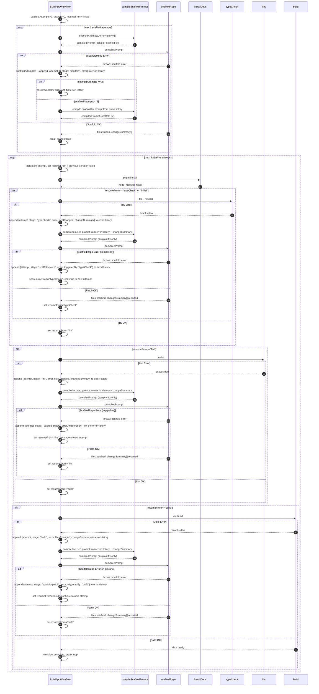

**AGENT PREAMBLE - READ FIRST:**
You are operating in OpenCode/Claude Code CLI. Before writing any code:
1. Confirm Temporal dev server is running at `localhost:7233`. If not, tell user: *"Run `C:\temporal\temporal.exe server start-dev` in a separate terminal first."*
2. Work in the current directory. Do not change drives or folders unless user specifies.
3. Create all files from scratch. Assume zero existing project files.
4. After creating `worker.ts`, `activities.ts`, `workflows/build-app.ts`, run `pnpm start`.
5. Do not ask for clarification. Begin immediately.

---

**Objective:** Build a TypeScript app using Temporal to orchestrate the entire build pipeline. Temporal owns all durable state. The agent receives a short, compiled, targeted prompt per retry — never a raw error transcript.

**App spec:**
`{Describe your app here. Example: "Vite + React + TypeScript chatbot. Backend: Supabase. Inference: OpenAI API. Folder: /app-chat"}`

---

**Workflow spec in Mermaid:**



---

**Requirements:**

**1. Workflow (`/workflows/build-app.ts`)**

Maintain this state throughout the workflow:
```typescript
interface ErrorEntry {
  attempt: number;
  stage: "scaffold" | "scaffold-patch" | "typeCheck" | "lint" | "build";
  error: string;              // exact, untruncated stderr
  filesChanged?: string[];    // files touched by the patch
  changeSummary?: string[];   // what actually changed inside those files
  triggeredBy?: string;       // for scaffold-patch: which stage caused it
}

let scaffoldAttempts = 0;
let attempt = 0;
let resumeFrom: "initial" | "typeCheck" | "lint" | "build" = "initial";
let errorHistory: ErrorEntry[] = [];
```

Rules:
- `scaffoldAttempts` tracks only the initial scaffold loop. Max 2. Throws with full `errorHistory` if exceeded.
- `attempt` tracks pipeline loop iterations. Max 3. Increments at the top of each pipeline loop iteration.
- `resumeFrom` determines which stage the pipeline resumes from. Never resets to `"initial"` inside the pipeline loop — only advances or stays.
- On every `scaffoldRepo` call anywhere in the workflow, first call `compileScaffoldPrompt(spec, errorHistory, attempt, resumeFrom)` and pass its output as the prompt. Never pass raw `errorHistory` directly to any activity.
- If pipeline attempts exhausted, throw a workflow error listing every `ErrorEntry` in `errorHistory`.

---

**2. `compileScaffoldPrompt` — pure workflow-side function (not an activity)**

```typescript
function compileScaffoldPrompt(
  spec: string,
  errorHistory: ErrorEntry[],
  attempt: number,
  resumeFrom: string
): string {

  // Mode A: initial scaffold
  if (errorHistory.length === 0) {
    return `
You are scaffolding a new app from scratch.
Spec: ${spec}
Requirements:
- Vite + React + TypeScript
- Create eslint.config.js with sensible flat config defaults
- All files must compile cleanly with tsc --noEmit and eslint
Return: a list of every file you created and a one-line summary of what each does.
    `.trim();
  }

  // Mode B: surgical patch
  const latest = errorHistory[errorHistory.length - 1];
  const previousFixes = errorHistory.slice(0, -1).map(e =>
    `  Attempt ${e.attempt} | ${e.stage}${e.triggeredBy ? ` (fixing ${e.triggeredBy})` : ""}:
     Files changed: ${(e.filesChanged || []).join(", ")}
     What changed: ${(e.changeSummary || []).join("; ")}`
  ).join("\n");

  return `
You are making a surgical fix to an existing app.
Spec: ${spec}

Current error to fix (fix this and only this):
  Stage: ${latest.stage}${latest.triggeredBy ? ` (triggered by ${latest.triggeredBy})` : ""}
  Error: ${latest.error}

What was already tried — do NOT repeat these:
${previousFixes || "  Nothing tried yet."}

Rules:
- Fix only the file(s) causing the current error above.
- Do not touch unrelated files.
- Do not repeat a fix already listed above.
- Return the exact list of files you changed and a one-line summary of what you changed in each.
  `.trim();
}
```

---

**3. Activities (`/activities.ts`)**

```typescript
scaffoldRepo(compiledPrompt: string): Promise<{
  filesChanged: string[];
  changeSummary: string[];
}>
// Executes the compiled prompt via the agent.
// Returns list of files written/modified + one-line summary per file.
// scheduleToCloseTimeout: 3 minutes

installDeps(): Promise<void>
// Runs: pnpm install inside /app-chat
// scheduleToCloseTimeout: 3 minutes

typeCheck(): Promise<{ ok: boolean; error?: string }>
// Runs: tsc --noEmit inside /app-chat
// Captures full stderr. Never truncate.
// scheduleToCloseTimeout: 2 minutes

lint(): Promise<{ ok: boolean; error?: string }>
// Runs: eslint . inside /app-chat
// Captures full stderr. Never truncate.
// scheduleToCloseTimeout: 2 minutes

build(): Promise<{ ok: boolean; error?: string; distPath?: string }>
// Runs: vite build inside /app-chat
// Captures full stderr. Never truncate.
// scheduleToCloseTimeout: 5 minutes
```

All activities must capture raw `stdout + stderr` combined. No summarizing. No truncating.

---

**4. Worker (`/worker.ts`)**

- Register all activities and `BuildAppWorkflow`.
- After worker starts, automatically trigger `BuildAppWorkflow` with the app spec as input.
- On each retry, log to console:
```
[Attempt N | stage] Error: <first 300 chars of error>
[Attempt N | stage] Compiled prompt: <full compiledPrompt>
[Attempt N | stage] Files changed: <filesChanged[]>
[Attempt N | stage] Change summary: <changeSummary[]>
[Attempt N | stage] resumeFrom: <resumeFrom>
```
This gives full visibility without bloating agent context.

---

**5. ESLint — scaffold on attempt 0:**
- `scaffoldRepo` must emit `eslint.config.js` (flat config) on the initial scaffold.
- A missing config error on attempt 1 is acceptable — `compileScaffoldPrompt` will produce a targeted fix. It will not waste the pipeline attempt budget.

---

**6. `resumeFrom` state machine — implement exactly as follows:**

```typescript
// At top of pipeline loop:
attempt++;

// After typeCheck passes:
resumeFrom = "lint";

// After typeCheck fails and patch applied (or patch fails):
resumeFrom = "typeCheck"; // stays, resumes here next iteration

// After lint passes:
resumeFrom = "build";

// After lint fails and patch applied (or patch fails):
resumeFrom = "lint"; // stays

// After build fails and patch applied (or patch fails):
resumeFrom = "build"; // stays

// After build succeeds:
// break loop, return distPath
```

---

**7. General rules:**
- Do NOT start a dev server inside Temporal.
- Workflow ends when `vite build` succeeds — return `/app-chat/dist`.
- All activity timeouts set explicitly. No implicit defaults.
- `compileScaffoldPrompt` is the only place that constructs agent prompts. Workflow code never passes raw `errorHistory` to any activity.
- Every `scaffoldRepo` call in the pipeline — whether triggered by typeCheck, lint, or build failure — must have its own `alt ScaffoldRepo Error` handler as shown in the diagram.

---

**Stack:** Vite + React + TypeScript + pnpm. Target folder: `/app-chat`

**Begin.**

